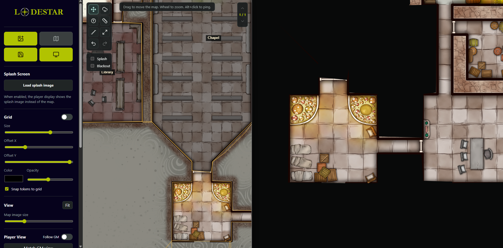

# Lodestar

**▶️ [Try it live](https://uncleplants.github.io/Lodestar/)** — runs instantly in your browser, no install.

A local-first battlemap display tool for game masters. Cast a map with fog of war to a second "player" screen while you control everything from a private GM panel. Lodestar runs entirely in the browser with **no build step and no dependencies** — open `index.html` and go. It's structured so it can later be wrapped as a desktop app (Electron, Tauri, or WebView2).

## Screenshots

*GM view on the left with named fog areas ("Chapel", "Library"); the player display on the right shows only what's been revealed.*

> Demo map: "Chapel of the Bountiful Harvest" (#287) by [Elven Tower Adventures](https://elventower.com), licensed under [CC BY 4.0](https://creativecommons.org/licenses/by/4.0/). Modified — fog-of-war overlay added in Lodestar.

## Features

- **Maps** — load high-resolution map images from local disk; pan and zoom freely.
- **Player display** — open a second window, drag it to another screen, and cast the map to your players. The player window can go fullscreen, and you can optionally let players pan and zoom their own screen. A red frame on the GM screen shows exactly what the players currently see.
- **Initiative tracker** — a dockable turn-order panel: add players, NPCs, and monsters with initiative and HP, advance turns and rounds, track damage/healing with HP bars, and optionally mirror a compact order overlay onto the player display.
- **Area of effect** — hover a live spell template (circle, square, or cone) over the map in any color and size; it mirrors to the player display in real time. The cone rotates with the mouse wheel or a direction slider.
- **Fog of war**
  - Trace polygon areas and click them in reveal mode to show/hide on the player display.
  - Name polygon areas with a GM-only label.
  - Drag-draw fog shapes (rectangle, square, ellipse, circle, triangle) for quick rooms.
  - Paint or erase fog with a round or square brush of adjustable size.
  - GM sees fog as an adjustable tint/opacity; players see solid black.
- **Multi-floor** — build multi-level locations; each floor has its own map, fog, tokens, and stairs. Navigate with the on-screen floor widget.
- **Stairs** — place GM-only staircase markers that link floors; they scale with the grid and zoom and are invisible to players.
- **Tokens** — drop, drag, label, color, size, or give them a custom image; they snap to the grid and appear on both displays. In Move mode, click a token to select it and nudge it cell by cell with the arrow keys (Delete removes it).
- **Grid** — toggle and adjust size, offset, color, opacity, and token snapping. Set the size quickly by dragging a square over one cell of the map.
- **Ping** — Alt+click draws an animated marker on both displays.
- **Measure** — reports distance in grid cells and your choice of imperial (feet) or metric (meters). If the map already has its own printed grid (and the overlay is off), calibrate the ruler by dragging a square over one cell.
- **Splash / blackout** — show a splash image or a plain black screen on the player display instead of the map.
- **Library** — save full setups (image, grid, fog, tokens, floors, views) to a local IndexedDB library; export/import the whole library as JSON for backups or moving machines.
- **Undo / redo** and **fit-to-screen**.

## Run

Use the **[hosted version](https://uncleplants.github.io/Lodestar/)**, or download the source and open `index.html` in a modern browser — both work identically and run fully offline once loaded. Load a map image, click **Open player display**, and move that window to your second screen (press **F** or double-click for fullscreen).

Use **Save map** to store the full setup in the local library and **My maps** to restore one. Use **Export** / **Import** in the GM panel to back the library up to a file.

## Saving and backups

When you save a map, everything (the image, fog, tokens, floors, grid, and view) is stored in your browser's own local storage (IndexedDB) on your machine. Nothing is ever uploaded to GitHub or anywhere else: the hosted version is just static files with no server behind it, so your maps never leave your computer. Because this storage is tied to a specific browser, device, and site address, a saved library only shows up when you reload from the same place you saved it. Maps saved on the hosted version won't appear if you later open a downloaded copy of `index.html` (a different address), or in a different browser, on another device, or in a private/incognito window. Clearing your browser's site data will also erase the library.

Downloading the local version is the same story. The download contains only the program files, not your maps, so a fresh copy opened on another computer starts with an empty library and won't pull in maps you saved elsewhere. Saving there writes to that computer's own browser storage, and each machine keeps its own separate library that never syncs on its own.

For anything you want to keep, use **Export** in the GM panel to save your whole library to a single JSON file you control, then **Import** it wherever you need it. That exported file is the only copy that isn't dependent on a browser setting, so it's the safe way to back up your maps or carry them from one computer to another.

## Keyboard shortcuts (GM)

- `V` move · `P` polygon fog · `N` named fog area · `R` reveal · `B` brush · `E` eraser · `T` tokens · `A` area of effect · `M` measure · `S` stairs
- `F` fit map · `[` / `]` brush size · `Ctrl+Z` undo · `Ctrl+Shift+Z` redo
- **Middle-mouse drag** pans the map in any tool, so you never have to switch tools just to reposition.
- Polygon mode: click corners, `Enter` to place, `Esc` to cancel. `Ctrl+Z` or `Backspace` removes just the last point you placed.
- `Alt+click` anywhere to ping · right-click a token, fog area, or stair to delete it

## Coordinate model

Fog, rooms, tokens, pings, measures, and stairs are all stored in **native image pixels**, so they stay glued to the map regardless of zoom or the "Map image size" slider. The view is expressed as a centered map point plus a zoom level, which is why **Match GM view** frames the same region on the player screen even though the two windows are different sizes. Fog is rasterized into an offscreen layer capped at 4096px on the long edge to bound memory on very large maps. Older save files are migrated automatically on load.

## Browser support

Tested on current Chromium-based browsers (Chrome, Edge). Requires `BroadcastChannel`, `IndexedDB`, `ResizeObserver`, and Canvas 2D — all standard in modern browsers. The GM and player windows communicate over both `BroadcastChannel` and direct `window.postMessage`, so the cast works even when opened from `file://`.

## Credits

See [CREDITS.md](CREDITS.md) for third-party icon attributions.

## License

Lodestar is released under the [MIT License](LICENSE). Bundled icons are under their respective open-source licenses (see [CREDITS.md](CREDITS.md)).
