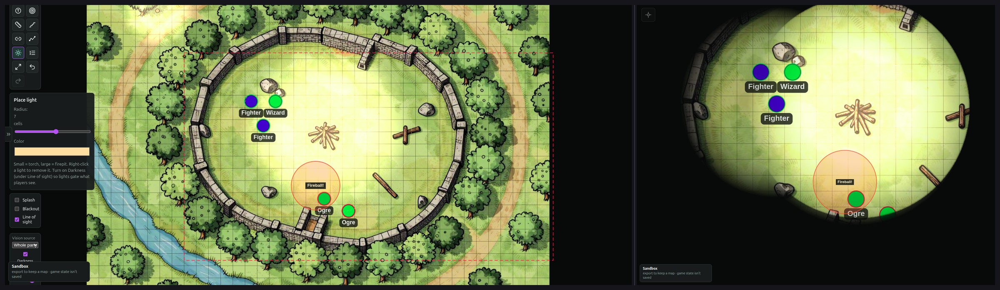

# vwag-table

A local-first virtual tabletop. The GM drives a private panel; players see a clean battlemap with fog, dynamic light, and line-of-sight, cast to a second screen. It runs entirely in the browser with no build step, no dependencies, and no account — serve the folder and go, fully offline.

**▶ Try it live at [vtt.worhl.net](https://vtt.worhl.net)** — a public sandbox, no install and no account. Drop a map and play; export anything you want to keep.

Two things are **optional add-ons, not requirements**: vwag-table is designed to drive a physical touch table with an infrared frame (but works fine with any display and a mouse), and it can connect to a backend for online play with remote players (see *Online play* below). Neither is needed for local, in-person use.

## Screenshots



*The GM panel on the left; the player display on the right showing the cast map with a named "Fireball" area of effect.*

> Demo map: "Stone Ring Camp," an original asset made with [zsky.ai](https://zsky.ai). Fog, tokens, dynamic light, and a named area of effect added in vwag-table.

## Running

Serve the folder over HTTP (not `file://`, so the player window and clipboard behave):

```
python3 -m http.server 8000
```

Open `http://localhost:8000` for the GM view. Click **Open player display** and move that window to your second screen or the touch table. The player view is also reachable directly at `?view=player`. The two windows stay in sync over `BroadcastChannel` — no server involved for local play.

## Features

- **Cast with fog of war** — reveal the map to players from a private GM panel; players never see your notes, controls, or unrevealed areas. The GM sees fog as an adjustable tint; players see solid black. Trace polygon areas, name them with a GM-only label, or paint with a brush; tokens and images under unrevealed fog stay hidden.
- **Dynamic vision and light** — line-of-sight raycasting with a spatial-grid cull, light coverage, and darkness. Place wall and obstacle geometry in Draw mode and drop light sources; player tokens are clipped to what's actually visible from where they stand. Line-of-sight is toggleable per session.
- **Online play (optional)** — beyond the same-room second screen, vwag-table can host a game for remote players over the internet. This needs a relay backend, which is **not part of this repo**. You have two paths: run your own WebSocket relay that implements the join/redeem and sync protocol, or connect to the VWAG backend by creating an account and logging in. (VWAG is the maintainer's own hosted instance, built for the Victen Worhl Adventure Game; it is separate from this open-source client.) Once connected, the GM mints a join code, a player redeems it on a landing page, and watches the table live — and can drag their own token — with each device fitting the GM's broadcast region to its own screen, letterboxed to its aspect.
- **Multi-floor maps** — build multi-level locations; each floor has its own map, fog, tokens, and stairs. The GM view and the players' table can track different floors independently, so you can prep one floor while players see another. Tokens traverse stairs between floors, individually or as a marquee-selected group.
- **Tokens** — drop, drag, label, color, and size tokens, or give them a custom image. Type rings distinguish players, NPCs, and monsters; tokens carry on-token HP and status/condition markers and have an edit panel. They snap to the grid and appear on both displays. Bulk-add by selecting multiple image files — each becomes a reusable token in your palette. On the player display, movement is touch-driven and synced GM-authoritative: the GM clamps and rebroadcasts every move.
- **Initiative** — a turn-order tracker with initiative and HP, linked to the board tokens: the active combatant is highlighted on the board on both the GM and player views. Advance turns and rounds, and import the party roster in one step.
- **Area of effect** — drop a persistent zone (circle, square, or cone) in any color and size, name it through a modal, and it commits and mirrors to the player display in real time with its label. Rename or recolor placed zones; the cone rotates with the mouse wheel.
- **Grid, measure, and calibration** — toggle and adjust the grid (size, offset, color, opacity, snapping). Calibrate by dragging a square over one cell: that sets the cell size, aligns the overlay to the map's own printed grid, and sets the ruler scale all at once. Measure reports distance in cells and your choice of feet or meters, using the 5e alternating-diagonal rule.
- **Rotation** — rotate the GM map in 90° steps (fog, tokens, and stairs ride along, and the player follows), or rotate just the player display so it reads right-side up from across a flat table.
- **Map-links and travel** — drop links between maps to move from a world map into a region, a region into a town, or a town into a building. The GM authors the links; players can follow them too — when a player takes a link, the whole party descends together to the linked map.
- **Splash / blackout** — show a splash image or a plain black screen on the player display instead of the map.
- **Map library and checkpoints** — save full setups (image, grid, fog, tokens, floors, views, and scale calibration) to a local IndexedDB library. With a backend connected, publish a map and its live game state and resume it later from any machine, so another table can pull the map or you can pick a session back up where you left off.
- **Ping**, **undo**, and **fit-to-screen**.

## Keyboard shortcuts (GM)

- `v` move · `t` tokens · `a` area of effect · `m` measure · `s` stairs · `d` walls (line-of-sight) · `l` light · `g` map-links
- `p` polygon fog · `n` named fog area · `b` brush · `e` eraser · `[` / `]` brush size
- `f` fit map · `Ctrl+Z` undo · arrow keys move a selected token (or pan when none is selected)
- `Alt+click` to ping · right-click a token, zone, or stair to remove it

## Saving and backups

Saved maps live in your browser's own IndexedDB on your machine — nothing is uploaded for local play. Because that storage is tied to a specific browser, device, and site address, a library only shows up when you reload from the same place you saved it. For anything you want to keep or move between machines, use **Export** to write your whole library to a single JSON file, then **Import** it wherever you need it.

## Lineage

vwag-table began as a fork of [Lodestar](https://github.com/UnclePlants/Lodestar) by UnclePlants, used under the MIT License, and has since diverged into its own program aimed at a physical IR touch table, an online tier for remote players, and the VWAG backend. It is no longer mergeable with upstream; upstream improvements are ported selectively, by hand, with UnclePlants' blessing.

Original authorship is retained and credited: the upstream `LICENSE` is preserved, and third-party icon attributions, demo artwork, and community thanks remain in [CREDITS.md](CREDITS.md).

## License

MIT — see [LICENSE](LICENSE). Bundled icons and demo artwork retain their original licenses; see [CREDITS.md](CREDITS.md).
